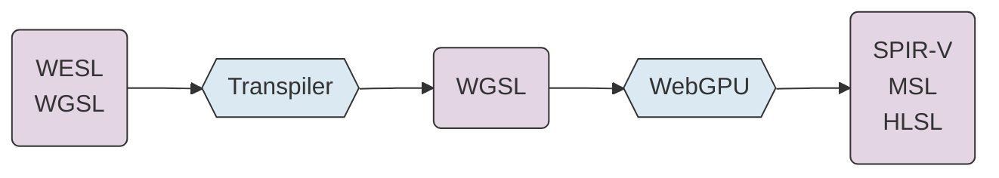
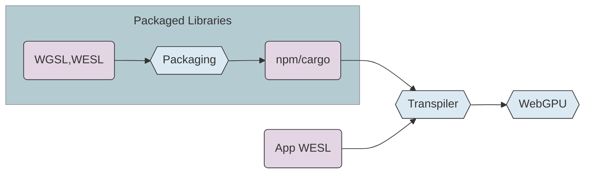
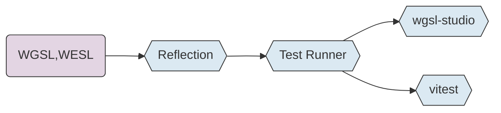

# Modern WebGPU

WebGPU tools and extensions for the Web

<div class="mt-12">

Lee Mighdoll

Stefan Brandmair (in spirit)

Mathis Brossier (in spirit)

<br/>
</div>

<div class="absolute right-12 top-20 flex flex-col items-center">

<a href="https://wesl-lang.dev/gdc-2026" class="text-sm mt-2 text-gray-500">wesl-lang.dev/gdc-2026</a>
</div>

<div class="absolute bottom-2 right-4 text-sm
text-gray-400">
GDC Khronos 2026
</div>

<!--
Copy down the QR code, these slides include demos you can play with 
right now if you want.

**tools** and **extension** for WebGPU 

Open source **WebGPU Tools Group**
-->

---

# WebGPU is Live
<div style="display: flex; gap: 1rem; margin-top: 1rem;">
  <wgsl-edit id="star-editor" style="flex: 1; min-width: 0; overflow: hidden; height: 400px; display: block;" theme="light"></wgsl-edit>
  <div style="display: flex; flex-direction: column; gap: 0.5rem; flex-shrink: 0;">
    <wgsl-play id="star-player" style="width: 200px; height: 200px; display: block;" transparent></wgsl-play>
    <label style="display: flex; align-items: center; gap: 0.5rem; font-size: 0.9rem; color: #666;">
      <input type="checkbox" id="star-noise" checked /> noise
    </label>
  </div>
</div>

<script setup lang="ts">
import { onMounted } from "vue"
import { initEditor, starDemoProject, connectPlayerToEditor } from "./wgsl-demos"
onMounted(() => {
  initEditor("star-editor", starDemoProject);
  const player = document.getElementById("star-player") as any;
  if (player) player.project = { conditions: { noise: true } };
  connectPlayerToEditor("star-player", "star-editor");
  const editor = document.getElementById("star-editor") as any;
  document.getElementById("star-noise")?.addEventListener("change", (e) => {
    const noise = (e.target as HTMLInputElement).checked;
    if (editor) { editor.conditions = { noise }; }
    if (player) { player.conditions = { noise }; }
  });
});
</script>

<!--
Put live WebGPU samples in slides!
(And on any web page)

**GPU magic** is very accessible
- just the code you see here.

use some modest **extensions** to the shader language

and some **web components**.

You can edit the code in this slide
-->

---

# WESL Extensions

````md magic-move
```wgsl

alias Complex = vec2f;

fn mandelbrot(position: Complex) -> f32 {
  .
  .
}

@fragment
fn main(@location(0) uv: vec2f) -> @location(0) vec4f {
  let escaped = mandelbrot(uv * 3.0 - vec2f(2.0, 1.5));
  let color = vec3f(escaped);

  return vec4(color, 1.0);
}
```
```wgsl
import super::graphics::mandelbrot;

@fragment
fn main(@location(0) uv: vec2f) -> @location(0) vec4f {
  let escaped = mandelbrot(uv * 3.0 - vec2f(2.0, 1.5));
  let color = vec3f(escaped);

  return vec4(color, 1.0);
}
```
```wgsl
import super::graphics::mandelbrot;
import lygia::color::palette::spectral::zucconi::zucconi6;

@fragment
fn main(@location(0) uv: vec2f) -> @location(0) vec4f {
  let escaped = mandelbrot(uv * 3.0 - vec2f(2.0, 1.5));
  let color = zucconi6(escaped);

  return vec4(color, 1.0);
}
```

```wgsl
import super::graphics::mandelbrot;
import lygia::color::palette::spectral::zucconi::zucconi6;

@fragment
fn main(@location(0) uv: vec2f) -> @location(0) vec4f {
  let escaped = mandelbrot(uv * 3.0 - vec2f(2.0, 1.5));

  @if(debug)
  let color = escaped;
  @else
  let color = zucconi6(escaped);

  return vec4(color, 1.0);
}
```

````

<!--
adds **modules** so people can split their shaders into separate files

adds **packaged library** support so people share the modules across organizations

adds **conditions** so people can **specialize** shaders at build or runtime

**extensions feel natural**
-->

---

# Extending WebGPU

<div class="mt-8 mb-8">

### WESL extensions are potential future WebGPU features

<div class="mt-4 ml-6">
Polyfill first, browser changes are forever.
</div>
</div>

### Enable users with WebGPU + tooling

<div class="mt-4 ml-6 ">
Load shader modules incrementally from external sources
</div>

<div class="mt-4 ml-6">
Hooks for test frameworks like <code>@test</code>
</div>

<div class="mt-4 ml-6">
Shader library packaging formats
</div>

<!--
We expect some extensions to turn into **proposals** for **future browser** implementation.
-->

---

# WESL - a Shader Front End


<div class="mt-6">

## Transpilation: like TypeScript to JavaScript


<div class="mt-4 ml-6 space-y-4">


### Add language ergonomics (modules, generics)

### Add shader/host code integration (reflection, injection)

### But strictly WebGPU compatible
Conformance Test Suite (CTS)
</div>

</div>


<!--
Extensions work via lightweight transpilation

We can add language ergonomics and integration features.

But the extensions are purely additive, intended **support** and only enhance WebGPU/WGSL.

Our tools are tested against both the browser conformance
test suite and the extensions test suite.  

-->

---


# WebGPU Tooling
For WGSL and WESL

<div class="grid grid-cols-2 gap-4 mt-4">

<div class="border rounded-lg p-4 bg-green-50">

### Linking / Packaging
<div class="ml-4 mt-2">

wesl-plugin - vite/rollup/webpack

build.rs - rust integration in wesl crate

wesl-packager - create npm packages
</div>
</div>

<div class="border rounded-lg p-4 bg-pink-50">

### Test 
<div class="leading-8">

wgsl-test - headless unit and image tests

wgsl-studio - VS Code tests / previews

</div>
</div>

<div class="border rounded-lg p-4 bg-yellow-50">

### Web Components 
<div class="ml-4 mt-2">

wgsl-edit - live shader editing

wgsl-play - web samples

</div>
</div>

<div class="border rounded-lg p-4 bg-blue-50">

### WGSL-analyzer 
<div class="ml-4 mt-2">

IDE language server

Code Formatter

</div>
</div>

</div>

---
layout: center
---

# Linking and Packaging

---

# Linking Shader Modules

<div class="grid gap-4 mt-8" style="grid-template-columns: auto 1fr">

<div>


### TypeScript
```ts
import wgslStr from "./shaders/app.wesl?static";
```

<v-click>
<br>
or at link at runtime:

```ts
import proj from "./shaders/app.wesl?link";

const linked = await link(proj, {MOBILE:true});
linked.createShaderModule(device);
```
</v-click>

**vite** / **webpack** / **rollup** plugins


</div>

<v-click>
<div>


### Rust
```rs
use wesl::Wesl;

let wgsl_str = Wesl::new("shaders")
    .set_feature("MOBILE", true)
    .compile("app.wesl")
    .unwrap()
    .to_string();
```

**build.rs** integration

</div>
</v-click>

</div>

<div class="absolute bottom-0">

[wesl-plugin](https://github.com/wgsl-tooling-wg/wesl-js/tree/main/tools/packages/wesl-plugin)
</div>

<!--
**in your app**, enable modules and other extensions

by adding a plugin to the bundler (like **vite** or **webpack**)

**?static** to transpile at build time

**?link** to transpile at runtime

or in rust
-->

---

# npm and cargo Libraries

<div class="mt-8">


</div>

<div class="space-y-4">

### Creating a Library is Easy
<div class="ml-8">

`wgsl-packager` command for npm

`wesl_pkg` macro for crates

</div>


</div>

<!--
**Packaging** a shader library for **publishing** is easy too

run a command and then publish as normal on **npm** or **cargo**
-->

---


<!--
Shader libraries as npm packages
-->

<div class="mt-4 space-y-2">

#### Usage

`npm add lygia`

</div>

<!--
users can use the library like any other npm package.

for example Lygia a large collection of shader functions from the Book of Shaders
-->

---


<!--
shader libraries as Rust crates

same sources, published two ways.
-->

<div class="mt-4 space-y-2">

#### Usage

`cargo add lygia`
</div>

<!--
cargo will work the same

note that same shares are published twice 

make it easy by connecting to existing dev and packaging tooling
-->

---
layout: center
---

# Testing

---

# wgsl-test / wgsl-studio



<div class="space-y-4">

### Unit Testing
Test shader functions with assertions in WGSL or TypeScript

### Image Snapshot Testing
Headless visual regression testing with diff reports

### wgsl-studio
VS Code extension for running tests, previewing images

</div>

<!--
testing is obviously important for developers

also seems likely to be especially important in the **AI era**

tests help keep our **agents on track**
-->

---

# `wgsl-test`: Unit Tests

```wgsl
/// interp_test.wesl
import package::interp::smootherstep; // source fn to test
import wgsl_test::expectNear;         // expectations

@test  // tag each test fn
fn smootherstepQuarter() {
  const result = smootherstep(0.0, 1.0, 0.25);
  expectNear(result, 0.103516);
}
```

<div class="mt-8 space-y-4">

### Shader functions drive tests

### Run in Node (Dawn) or Deno (wgpu)

### Vitest integration available
</div>


<div class="absolute bottom-0">

[wgsl-test](https://github.com/wgsl-tooling-wg/wesl-js/tree/main/tools/packages/wgsl-test)
</div>

<!--
wgsl-test: **headless** unit and visual regression tests

write unit **tests in shader code**
-->

---

# `wgsl-test`: Image Snapshot Tests


<!--
image snapshot runs **headless in CI**, no browser required.

It produces a nice little **html report** on failures.

-->

---

# wgsl-studio: VSCode Tests


<!--
For **VS Code** we've a new extension called **wgsl-studio**.

Shows **test catalog**, **live test results**
-->

---

# wgsl-studio: VSCode Shader Previews


<!--
and also **previews from shaders**

These are live rendered and update as you change the code.
-->

---
layout: center
---

# Web Components

---

<!--
web components to mix into your web sites

saw an example the first slide or two
-->

# `<wgsl-play>`: Web Viewer

<div class="grid grid-cols-2 gap-4 mt-4">

<div class="space-y-4 mt-4">

### Shader inline in HTML
```html
/// index.html
<wgsl-play id="player"></wgsl-play>
```

<v-click>
<div style="margin-top: 4rem;">

or

### Shaders in separate files

```ts
/// app.ts
import proj from "./draw_shapes.wesl?link";

document.querySelector("#player").project = proj;
```

</div>
</v-click>

</div>

<div>

<wgsl-play id="demo-player" style="width: 400px; height: 400px; display: block;" autoplay="false"></wgsl-play>

</div>

</div>

<script setup>
import { onMounted } from "vue"
import { initPlayer, drawShapesProject } from "./wgsl-demos"
onMounted(() => initPlayer("demo-player", drawShapesProject))
</script>

<!--
**wgsl-play** low boilerplate way to put a shader on a web page

you can put the shader code **inline** in the html

using the **bundler** plugin and **?link** 

handy when there's **15 files** as in this example 
-->

---

# `<wgsl-edit>`: Web Editor

<div style="display: flex; gap: 1rem; margin-top: 1rem;">
  <wgsl-edit id="demo-editor" style="flex: 1; min-width: 0; overflow: hidden; height: 400px; display: block;" theme="light"></wgsl-edit>

<div style="width: 400px; flex-shrink: 0;">

```html
/// index.html
<wgsl-edit id="edit"></wgsl-edit>
```

<v-click>

<div style="margin-top: 2rem;">

### Combine with wgsl-play
</div>

<div style="margin-top: .5rem;">

```html
<wgsl-play id="play" source="edit"></wgsl-play>

<wgsl-edit id="edit" lint-from="play"></wgsl-edit>
```
</div>

</v-click>

</div>
</div>

<script setup>
import { onMounted } from "vue"
import { initEditor, mandelbrotProject } from "./wgsl-demos"
onMounted(() => initEditor("demo-editor", mandelbrotProject))
</script>

<!--
**wgsl-edit** is a similar component for people who want to put 
a WebGPU **shader editor** on their sites

It uses **codemirror** under the hood, can to **embed on mobile**

and of course it **interoperates** with wgsl-play
-->

---

# wgsl-edit + wgsl-play

<div style="display: flex; gap: 1rem; height: 420px; margin-top: 1rem;">
  <wgsl-edit id="combo-editor" style="flex: 1; min-width: 0; overflow: hidden; display: block;" theme="light"></wgsl-edit>
  <wgsl-play id="combo-player" style="width: 400px; aspect-ratio: 1; flex-shrink: 0; align-self: start; display: block;" autoplay="false"></wgsl-play>
</div>

<script setup>
import { onMounted } from "vue"
import { initEditor, mandelbrotProject, connectPlayerToEditor } from "./wgsl-demos"
onMounted(() => {
  initEditor("combo-editor", mandelbrotProject);
  connectPlayerToEditor("combo-player", "combo-editor");
});
</script>

<!--
editor and player linked: edit code, see live output

-->

---

# Errors & Live Loading

<div style="display: flex; gap: 1rem; height: 420px; margin-top: 1rem;">
  <wgsl-edit id="error-editor" style="flex: 1; min-width: 0; overflow: hidden; display: block;" theme="light"></wgsl-edit>
  <wgsl-play id="error-player" style="width: 400px; aspect-ratio: 1; flex-shrink: 0; align-self: start; display: block;" autoplay="false"></wgsl-play>
</div>

<script setup>
import { onMounted } from "vue"
import { initEditor, mandelbrotErrorProject, mandelbrotErrorSrcBroken, connectPlayerToEditor } from "./wgsl-demos"
onMounted(() => {
  initEditor("error-editor", mandelbrotErrorProject, mandelbrotErrorSrcBroken);
  connectPlayerToEditor("error-player", "error-editor");
});
</script>

<!--
This version starts with syntax error. 

You can see the error reported both in the player and in the editor.

... in the process of adding a little noise to the image. 

Using a library that's not built in to the app

It's all web based.. so we can let users add arbitrary npm packages
on demand..

watch the lower left

[add semicolon]

That's the notification as the library is live loaded from npm.
-->

---

# wgsl-edit: user editable shaders

<div class="relative flex-1">
  
  
  <a href="https://zero.hypatia.earth" target="_blank" class="text-sm opacity-70 hover:opacity-100 absolute bottom-0 left-0">zero.hypatia.earth</a>
</div>

<!--
you can use **wgsl-edit** to provide user editable shaders in your web applications.

forthcoming **hypatia** app, allowing advanced users to hack their own weather layers with a snippet of shader code.
-->

---

# wgsl-analyzer

<div class="mt-8 space-y-6">

### Language server for WGSL/WESL

<div class="ml-6">

VSCode

Emacs / neovim / etc.

</div>

### Incremental and error resilient

based on production rust-analyzer

</div>

<!--
language server to support **vscode and other editors**
-->

---

# Syntax highlighting
Programming, now in color

<div class="relative mt-4 overflow-hidden" style="height: 260px;">
  <div class="relative" style="width: 1200px; height: 500px; transform: scale(0.6); transform-origin: top left;">
    
    
  </div>
</div>

<!--
Programming is prettier when you have **colors**.

**Typechecking** hints too
-->

---

# Autocomplete
Semantic aware code suggestions


<div class="flex items-start mt-8 flex-1 overflow-hidden">

</div>

<!--
typical features works like you'd imagine

go to definition

naturally, works across modules, libraries

-->
---

# Error Robustness
Resilient parser to report multiple errors

<div class="flex items-start mt-8 flex-1 overflow-hidden">

</div>

<!--
typechecking other code still works even w/o errors

when your code has an error

.. the rest of the language server continues to work

notice how the second line typechecks despite the errors.
-->

---

# Formatting
Standard pretty code layout

<div class="relative mt-4 overflow-hidden" style="height: 260px;">
  <div class="relative" style="width: 1200px; height: 500px; transform: scale(0.6); transform-origin: top left;">
    
    
  </div>
</div>

<!--
code formatter coming soon too.

in larger teams, you want a consistent shader code base
-->

---
layout: center
---

# Closing Thoughts

---

# Tools for WebGPU

<div class="mt-8 ">

### GPU magic on any web page
<div class="ml-8 mt-4">
Tooling makes it easier

Testing is recommended
</div>
</div>

<div class="mt-8 ">

### Avoid building shaders from strings

<div class="ml-8 mt-4">
Common extensions enable standard tools
</div>
</div>


<div class="mt-8 ">

### Share your WebGPU challenges

<div class="ml-8 mt-4">
Maybe we can help with tools or extensions
</div>
</div>


<!--
**GPU magic** on any **web page**

**tools** make it even easier to **build and maintain**

If you find the need to extend WebGPU, work with us
on **common extensions**. It's all open source.

We'd love your **feedback**, and your help.

**star the repo** and

**spread the word** on all these new tools.

-->

---
layout: center
---

# Thank You

<div class="mt-12">

[wesl-lang.dev](https://wesl-lang.dev)
&nbsp; &nbsp; &nbsp; 
[WESL discord](http://discord.gg/Ty7MjWVfvh)

<div class="flex gap-8 mt-24 mb-8">
<a href="https://crates.io/crates/wesl">wesl-rs</a>
<a href="https://www.npmjs.com/package/wesl-js">wesl-js</a>
<a href="https://www.npmjs.com/package/wgsl-test">wgsl-test</a>
<a href="https://www.npmjs.com/package/wgsl-play">wgsl-play</a>
<a href="https://www.npmjs.com/package/wgsl-edit">wgsl-edit</a>
<a href="https://github.com/wgsl-tooling-wg/wesl-js/tree/main/tools/packages/wesl-plugin">wesl-plugin</a>
<a href="https://marketplace.visualstudio.com/items?itemName=webgpu-tools.wgsl-studio">wgsl-studio</a>
</div>

[lygia](https://www.npmjs.com/package/lygia)
&nbsp; &nbsp; [hypatia](https://zero.hypatia.earth)


</div>

<a href="https://wesl-lang.dev/gdc-2026/" target="_blank" class="absolute bottom-2 right-4 text-sm text-gray-400">wesl-lang.dev/gdc-2026</a>

---
layout: center
---

# Extras

---

# WESL Tomorrow

### Module System Enhancements
<div class="mt-4 ml-6">
Wildcards

Visibility control
</div>

### Host / Shader Interface
<div class="mt-4 ml-6">
Parameterized modules

Reflection

</div>

### Generics / Typeclasses
<br/>

<!--
Now that we have the basics down, there are **more language features** under way.
-->

---

# `wgsl-test`: Vitest Integration Available
or jest or mocha

```ts
import { testCompute } from "wgsl-test";

const src = `
  import package::hash::lowbias32;

  @compute @workgroup_size(1)
  fn main() {
    env::results[0] = lowbias32(0u);
    env::results[1] = lowbias32(42u);
  }
`;

const result = await testCompute({ device, src });
```

Return a result and validate in any test library

Handy for complicated validation / setup

<!--
or **return** the results back to the host code, 
TypeScript in this case.

Useful for example if you want to validate results
with your **statistics** library.
-->

---

# Shaders in NPM 

```ts
/// dist/weslBundle.js
export const weslBundle = {
  name: "lygia",          // basic metadata
  edition: "2026_pre",
  modules: {
    "math/permute.wesl":  // relative paths to support shader linking

        // shader source text
    ` import lygia::math::mod289;
      fn permute(x: f32) -> f32 {
        return mod289(((x * 34.0) + 1.0) * x);
      }`
  },
  dependencies: [],       // js handles dependencies & versions
};
```

<div class="mt-8 space-y-6">

### Use npm for package management (and cargo)

### Simple text format for stability

</div>


<!--
Simple format

Don't reinvent package management, integrate with existing dev tooling.
-->

---

# Designing a Library Format for WebGPU

<div class="mt-8 space-y-6">

### Text format for stability
<div class="ml-8">
Human-readable, diffable, versionable

Optimize size/speed when the library is used
</div>

### npm/cargo mappings
Don't reinvent package management

### Simple encoding = stable encoding
Minimize complexity for long-term compatibility

</div>

<!--
**Text format for stability**

**slot it into existing ecosystems**
-->
