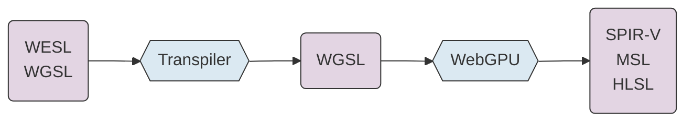
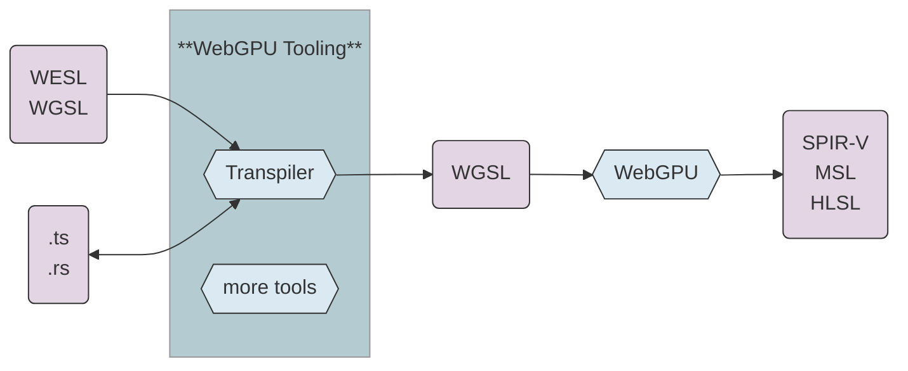
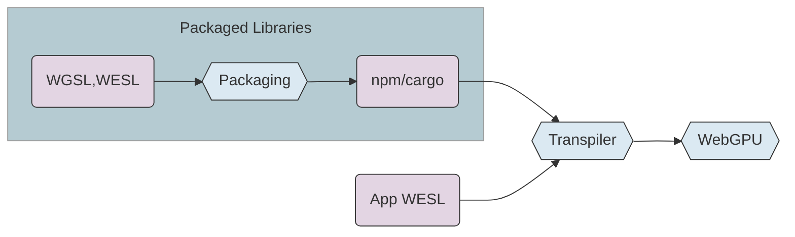
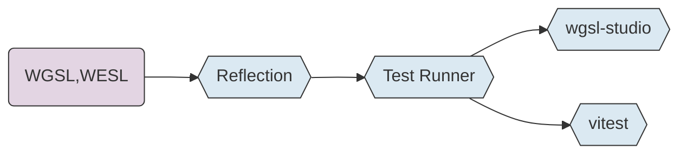
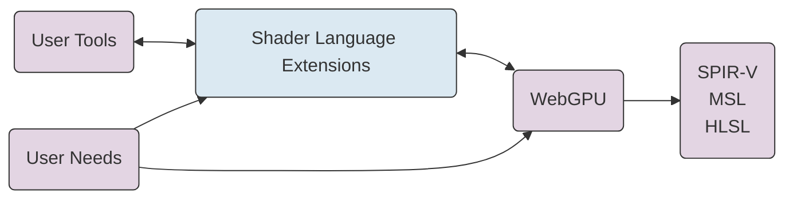

---

<!--
TODO:
- extra slides for upcoming wgsl features 
  - [might be nice to get feedback on these outside/after the talk]
  - param const
  - wildcard imports
  - @publish
  - more?
-->

# WESL

A Pioneer Language for WebGPU

<div class="mt-12">

Lee Mighdoll

Stefan Brandmair

Mathis Brossier (in spirit)

<br/>
</div>

<div class="absolute right-12 top-20 flex flex-col items-center">

<a href="https://bit.ly/wesl-2026" class="text-sm mt-1">https://bit.ly/wesl-2026</a>
</div>

<div class="absolute bottom-2 right-4 text-sm             
text-gray-400">                                           
Shader Languages Symposium<br>
February 2026
</div>

<!--
We're going to talk about our extensions to WebGPU's shader language

and the user tooling that drives developing those extensions.
-->

---

# Vision

<div class="mt-6 space-y-6">

### Empower a new generation of shader developers

### Integrate WebGPU programming into modern development

### Flourishing of GPU apps, big and small
</div>

<!--
WebGPU can extend **modern shader programming** to a broad audience.

We think WESL and the WebGPU tooling enabled by WESL can help to
**'complete' the developer experience**.
-->

---

# WESL Extensions

````md magic-move
```wgsl

alias Complex = vec2f;

fn mandelbrot(position: Complex) -> f32 { 
  .
  .
}

@fragment
fn main(@location(0) uv: vec2f) -> @location(0) vec4f {
  let escaped = mandelbrot(uv * 3.0 - vec2f(2.0, 1.5));    
  let color = vec3f(escaped);
 
  return vec4(color, 1.0);
}
```
```wgsl
import super::graphics::mandelbrot;

@fragment
fn main(@location(0) uv: vec2f) -> @location(0) vec4f {
  let escaped = mandelbrot(uv * 3.0 - vec2f(2.0, 1.5));    
  let color = vec3f(escaped);
 
  return vec4(color, 1.0);
}
```
```wgsl
import super::graphics::mandelbrot;
import lygia::color::palette::spectral::zucconi::zucconi6;

@fragment
fn main(@location(0) uv: vec2f) -> @location(0) vec4f {
  let escaped = mandelbrot(uv * 3.0 - vec2f(2.0, 1.5));    
  let color = zucconi6(escaped);

  return vec4(color, 1.0);
}
```

```wgsl
import super::graphics::mandelbrot;
import lygia::color::palette::spectral::zucconi::zucconi6;

@fragment
fn main(@location(0) uv: vec2f) -> @location(0) vec4f {
  let escaped = mandelbrot(uv * 3.0 - vec2f(2.0, 1.5));    

  @if(debug)
  let color = escaped;
  @else
  let color = zucconi6(escaped);

  return vec4(color, 1.0);
}
```

````

<!--
A peek at some of the extensions in WESL:

starts with WGSL

adds **modules** so people can split their shaders into separate files

adds **packaged library** support so people share the modules across organizations

adds **conditionals** so people can customize shaders at build or runtime

starts from WGSL and adds **extensions feel natural**

(WESL extensions are implemented with lightweight transpiler that we'll discuss later in the talk)
-->

---

# Why Extend WGSL/WebGPU?

### WESL extensions are potential future WGSL features

<div class="ml-6 mt-4">
Strict superset of WGSL

WebGPU Conformance Test Suite (CTS)
</div>


### Pioneer new features with low risk

<div class="mt-2 ml-4">
Explore first 
</div>

<div class="mt-2 ml-4">
Browser changes are forever
</div>

<br/>

### Some features might not belong in browsers

<div class="mt-2 ml-4">
Load shader modules incrementally from external sources
</div>

<div class="mt-2 ml-4">
Hooks for test frameworks
</div>

<div class="mt-2 ml-4">
Shader library packaging formats
</div>

<!--
WESL extensions are designed as proposals for **future browser** implementation.

Toward that end, we maintain and test for strict upward compatibility with WGSL. Our tools run the same **compatibility test suite** as the browsers.

It makes sense to develop some language features **outside the browser core**.
- it's **easier to iterate**: open source tools vs. multiple browsers
- some features may belong in tools indefinitely.
-->

---

# WESL Language Aims

### Practical support for the WebGPU ecosystem

Always driven by community needs

### Support core WGSL/WebGPU development

Work closely with WebGPU commmittee

### Tools support WGSL and WESL

<!--
We drive language design from **use cases**, from community shaders and tool needs

Support, **not a substitute** for WebGPU/WGSL.

We want to help grow the ecosystem, not create a **splinter language**.

All our tools support both vanilla WGSL plus extensions.
-->

---

# Power Features and Simple Users

<div>


</div>

<!--
We expect that as WebGPU proliferates, there'll be a lot of small projects.

a churning flow of new programmers from the web community.

Translates to lots of **new and part time shader programmers**. 

There's a premium on **simplicity**

Every **new feature** we add is a 'tax' on new users. 

Any new features have to pay their weight in new user learning tax.

For similar reasons we try to chart a **neutral** path among **language influences**. 

We can't count on our programmers to be familiar with Rust or TypeScript or C++ or Ocaml or Scala. 

Most non-trivial features will be new to most of users.
-->

---

# WESL Today

### Language Features
Import, conditional compilation

### Shader libraries for npm (JavaScript) and cargo (Rust)
Libraries of shader functions

<!--
Glimpsed earlier some of the features we have today
-->

---

# WESL Tomorrow

### Module System Enhancements
<div class="mt-4 ml-6">
Wildcards

Visibility control
</div>

### Host / Shader Interface
<div class="mt-4 ml-6">
Parameterized modules 

Reflection

</div>

### Generics / Typeclasses
<br/>

<!--
There are **more language features** under way. 

Medium term, **Reflection and Generics** should enable a richer class of apps and libraries
-->

---

# WESL - a Shader Front End


<div class="mt-2 space-y-6">

### language ergonomics (modules, generics)

### shader/host code integration (reflection, injection)

</div>

<!--
Of course, there are limits to what we can do with WESL.

We are a shader front end.

We can rewrite shader source code,

but the underlying vulkan APIs are inaccessible to us. 

So we can try generics in WESL, but not bindless.
-->

---
layout: center
---

# Tools

<!--
Now let's start talking the tools that are a main driver of shader language extensions
-->

---

# WESL Enables WebGPU Tooling


<div class="mt-2 space-y-6">

### 2025 - Linking and Packaging Tools
### 2026 - Testing, Documentation, IDE tools

</div>

<!--
We built linking and packaging tools first.

And there's some new tools that are **freshly available**
or will be available in the next few weeks.
-->

---

# WebGPU Tooling
For WESL and WGSL

<div class="grid grid-cols-2 gap-4 mt-4">

<div class="border rounded-lg p-4 bg-gray-50">

### Linking / Packaging
<div class="ml-4 mt-2">

wesl-plugin - vite/rollup/webpack 

build.rs - rust integration

wesl-cli - link or package from cli
</div>
</div>

<div class="border rounded-lg p-4 bg-green-50">

### Editor Support
<div class="ml-4 mt-2">

wgsl-analyzer - IDE Language Server

wgsl-edit - web editor

</div>

</div>

<div class="border rounded-lg p-4 bg-green-50">

### Documentation Tools 
<div class="ml-4 leading-8 mt-2">

wesl-doc - HTML documentation generator

wgsl-play - web samples

</div>
</div>


<div class="border rounded-lg p-4 bg-green-50">

### Test Tools
<div class="leading-8">

wgsl-test - native and vite/jest tests

wgsl-studio - IDE test runner

</div>

</div>

</div>

<!--
An overview of the tools we're going to talk about.
-->

---
layout: center
---

# Linking and Packaging

---

# Linking Shader Modules

<div class="grid grid-cols-2 gap-4 mt-8">

<div>


### TypeScript
```ts
import { link } from "wesl";
import appWesl from "./shaders/app.wesl?link";

const linked = await link(appWesl);

linked.createShaderModule(device);

```

**vite** / **webpack** / **rollup** plugins


</div>

<div>


### Rust
```rs
use wesl::Wesl;

let wgsl_str = Wesl::new("shaders")
    .compile("app.wesl")
    .unwrap()
    .to_string();
```

**build.rs** integration

</div>

</div>

<div class="space-y-6 mt-12">

### Transpile & link at build or runtime

### CLI linkers also available

</div>

<!--
A peek at what **using WESL** looks like for an app.

Our goal:

very few lines of code to add WESL to a WebGPU project

Meet developers where they are.

Plugin the tools/workflow they already use.

made plugins for your favorite bundlers.

If you're a typescript developer using a bundler the left side should look vaguely familiar 

If you're a rust developer, plugging into build.rs should be familiar.

cli tools are also available for linking too, for users with more custom build setups

And a playground for people who want to view the WESL to WGSL transpilation.

Basically if you want to be able to link modules of WGSL shaders together
we have an answer for you now.

.. Not just app shaders
-->

---

# npm and cargo Libraries

<div class="mt-8">


</div>

<div class="space-y-4">

### Creating a Library is Easy
<div class="ml-8">

`wgsl-packager` command for npm

`wesl_pkg` macro for crates

</div>

### 

### Tools are Library Aware
</div>

<!--
the logical next step is **enabling libraries**

The WebGPU community right now is full of copy-paste

It's easy: 
- one cli command for npm
- one line of code for rust
-->

---


<!--
Shader libraries as npm packages
-->

<div class="mt-4 space-y-2">

#### Usage

`npm add lygia`

</div>

<!--
use for example Lygia a large collection of shader functions from the Book of Shaders

just:  npm add lygia

just like you would any other package
-->

---


<!--
shader libraries as Rust crates

same sources, published two ways.
-->

<div class="mt-4 space-y-2">

#### Usage

`cargo add lygia`
</div>

<!--
and cargo will just about the same way

in a few days :-)

its the exact same set of shader functions, 

published twice so that they're natively accessible to rust and ts/js communities

it's possible because we're sharing same standard set of extensions
-->

---

# Designing a Library Format for WebGPU

<div class="mt-8 space-y-6">

### Text format for stability
<div class="ml-8">
Human-readable, diffable, versionable

Optimize size/speed when the library is used
</div>

### npm/cargo mappings
Don't reinvent package management

### Simple encoding = stable encoding
Minimize complexity for long-term compatibility

</div>

<!--
Zoom in on the issue of Enabling Libraries for WebGPU

**Text format for stability**

**slot it into existing ecosystems**
-->

---

# JS Library Embedding

```ts
/// dist/weslBundle.js
export const weslBundle = {
  name: "lygia",          // basic metadata
  edition: "2026_pre",
  modules: {
    "math/permute.wesl":  // relative paths to support shader linking

        // shader source text
    ` import lygia::math::mod289; 
      fn permute(x: f32) -> f32 { 
        return mod289(((x * 34.0) + 1.0) * x); 
      }`
  },
  dependencies: [],       // js handles dependencies & versions
};
```

Shaders are packaged as JavaScript strings.

The library publisher builds the bundle.

Tools read packages automatically (vite, webpack, cli, test).

<!--
The npm library bundle format is automatically generated.

It looks like roughly like this on the inside:

mostly, just the shader text:

plus a minimal set of metadata

like the relative path, for module linking

and dependencies to other bundles for inter-library references
-->

---

# Rust Library Embedding

<div class="grid grid-cols-2 gap-4 mt-4">
<div>

#### Publisher 

```rs
/// lib.rs
use wesl::wesl_pkg;

wesl_pkg!(random);
```
</div>

<div>

#### Library Consumer

```rs
/// build.rs
fn main() {
  wesl::PkgBuilder::new("random")
    .scan_root("src/shaders").unwrap()
    .build_artifact().unwrap();
}
```

</div>
</div>

Rust shader libraries are packaged as shader source files plus a macro call.

The `wesl_pkg` macro loads the sources into Rust strings. 

The library user builds the bundle.

<!--
The rust format is **similar** internally to the npm one,
shaders are packaged as rust strings.

Rust **procedural macro** conventions let us construct the embedding as the developer uses the library.
-->

---
layout: center
---

# Testing

---

# wgsl-test / wgsl-studio



<div class="space-y-4">

### Unit Testing
Test shader functions with assertions in WGSL or TypeScript

### Image Snapshot Testing
Visual regression testing with diff reports

### wgsl-studio
VS Code extension for running tests, previewing images

</div>

<!--
testing is obviously important for developers

also seems likely to be especially important in the **AI era**

tests help keep our **agents on track**
 
Goal: integrate with **developer workflows**, 
- **continuous integration** friendly testing 
- integrate w/ **existing test frameworks** where appropriate
- **VSCode**

We now have some fresh new ways to do:
- Unit testing
- image snapshot testing

on WebGPU
-->

---

# `wgsl-test`: Unit Tests

```wgsl
/// interp_test.wesl
import package::interp::smootherstep; // source fn to test
import wgsl_test::expectNear;         // expectations 

@test  // tag each test fn
fn smootherstepQuarter() {
  const result = smootherstep(0.0, 1.0, 0.25);
  expectNear(result, 0.103516);
}
```

Test shader functions with shader functions

Validate with shader functions

Run tests with wgsl-test cli runner

Tests run in Node (Dawn) or Deno (wgpu)


<div class="absolute bottom-0">

[wgsl-test](https://github.com/wgsl-tooling-wg/wesl-js/tree/main/tools/packages/wgsl-test)
</div>

<!--
wgsl-test: **headless** unit and visual regression tests from the **cli**

Users write unit tests in shader code
- that's how shader functions are meant to be called

Users can also put **validation** [expect functions] in shader code
(Next slide shows an alternate approach)

Where feasible, it's nice to **declare** 
everything in shader code: 

setup, test & validation
-->

---

# `wgsl-test`: Vitest Integration Available
or jest or mocha

```ts
import { testCompute } from "wgsl-test";

const src = `
  import package::hash::lowbias32;

  @compute @workgroup_size(1)
  fn main() {
    test::results[0] = lowbias32(0u);
    test::results[1] = lowbias32(42u);
  }
`;

const result = await testCompute({ device, src });
```

Return a result and validate in any test library

Handy for complicated validation / setup

<!--
here's a simple example of running a unit test 
but this time **returning** the result back to
to run validation in TypeScript.

you can imagine for complicated **statistical** tests, you might prefer to write the validation in host code.
-->

---

# `wgsl-test`: Image Snapshot Tests


<!--
you can also do image snapshot testing.

runs in CI, no browser required.

It produces a nice little html report on failures.

...so that's command line tooling.
-->

---

# wgsl-studio: VSCode Tests


<!--
For **vscode** we've a new vscode extension available called **wgsl-studio**.

It uses the wgsl-test core (and the Dawn webgpu engine) to support a test runner in VsCode.

On the left you can see that the **'test explorer'** shows both vitest tests and native tests.

On the right you can see errors reported along with the failing function.

As an **aside** on design here..
The **astute observer** might notice that the error is reported at the function, not the 'expect' call that's failing.

This is an example of how tool needs can drive the design for language extensions. 
- users want a tool to run tests in their dev environment
- to build a better tool, we need some language affordance to report the current source line.
-->

---

# wgsl-studio: VSCode Shader Previews


<!--
**previews from shaders** 

like the ones that that generate **image snapshots** are also viewable in wgsl-studio. 

These are live rendered and update as you change the code.
-->

---
layout: center
---

# Web Site Tools

<!--
next set of tools

adding WebGPU to web sites.
-->

---

# wgsl-play / wgsl-edit

<div class="mt-8 space-y-6">

### Interactive Code Samples
Editable shader examples embedded in documentation

### Live Preview
See shader output in real-time as you edit

</div>

<!--
Some web components for using WESL/WGSL on web pages
-->

---

# `<wgsl-play>`: Web Viewer 

<div class="grid grid-cols-2 gap-4 mt-4">

<div class="space-y-4">

```html
/// index.html
<wgsl-play id="player"></wgsl-play>
```

<div class="mt-4">

### Shader inline in HTML

</div>

<v-click>

<div style="margin-top: 2rem;">

```ts
/// app.ts
import shader from "./draw_shapes.wesl?link"

document.querySelector("#player").project = shader
```

</div>

<div>

```rs
/// draw_shapes.wesl
import lygia::space::rotate;
import lygia::sdf::gearSDF;
...
```

</div>

<div class="mt-4 space-y-2">

### Shaders in separate files

</div>

</v-click>

</div>

<div>

<wgsl-play id="demo-player" style="width: 400px; height: 400px; display: block;" autoplay="false"></wgsl-play>

</div>

</div>

<script setup>
import { onMounted } from "vue"
import { initPlayer, drawShapesProject } from "./wgsl-demos"
onMounted(() => initPlayer("demo-player", drawShapesProject))
</script>

<!--
**wgsl-play** is a convenient way to put simple shaders on a web page

note that this is the same code as the image snapshot tests

so regression **tests can do double duty as demos**.

[press play]

this is the component used **inside the vscode extension** too.

**couple of lines in html** to get a player

you can put the shader code **inline** in the html

[press pause]

or keep it in a separate file.

In this example we're using the **wesl-plugin's ?link** from link

one line of code to automatically assemble a dozen shader modules.

Also, interested
in pursuing this **correspondence** between **image tests** and **demos**.

**Declarative annotations** to add to make a shader runnable seem like 
they work for tests and demos..

Interested in learning from you about ways to make declarative tests and demos.
-->

---

# `<wgsl-edit>`: Web Editor

<div style="display: flex; gap: 1rem; margin-top: 1rem;">
  <wgsl-edit id="demo-editor" style="flex: 1; min-width: 0; overflow: hidden; height: 400px; display: block;" theme="light"></wgsl-edit>

<div style="width: 400px; flex-shrink: 0;">

```html
/// index.html
<wgsl-edit id="edit"></wgsl-edit>
```

<v-click>

<div style="margin-top: 2rem;">

### Combine with wgsl-play
</div>

<div style="margin-top: .5rem;">

```html
<wgsl-play id="play" source="edit"></wgsl-play>

<wgsl-edit id="edit" lint-from="play"></wgsl-edit>
```
</div>

</v-click>

</div>
</div>

<script setup>
import { onMounted } from "vue"
import { initEditor, mandelbrotProject } from "./wgsl-demos"
onMounted(() => initEditor("demo-editor", mandelbrotProject))
</script>

<!--
another web component called **wgsl-edit**
for people who want to put a WebGPU **shader editor** on their sites

uses **codemirror** under the hood, can to **embed on mobile**

**tabbed interface**

[click tabs, dbl click to rename, + to add new]

and it **interoperates** with wgsl-play
-->

---

# wgsl-edit + wgsl-play

<div style="display: flex; gap: 1rem; height: 420px; margin-top: 1rem;">
  <wgsl-edit id="combo-editor" style="flex: 1; min-width: 0; overflow: hidden; display: block;" theme="light"></wgsl-edit>
  <wgsl-play id="combo-player" style="width: 400px; aspect-ratio: 1; flex-shrink: 0; align-self: start; display: block;" autoplay="false"></wgsl-play>
</div>

<script setup>
import { onMounted } from "vue"
import { initEditor, mandelbrotProject, connectPlayerToEditor } from "./wgsl-demos"
onMounted(() => {
  initEditor("combo-editor", mandelbrotProject);
  connectPlayerToEditor("combo-player", "combo-editor");
});
</script>

<!--
editor and player linked: edit code, see live output

[press play]

see errors from Dawn

[edit vec4f to vec3f]

see errors from the WESL transpiler

[rm comma after purple]

It's all web based.. so we can do things like
load new packages straight from npm on demand.

I'm going add a little noise to the image from another npm library

 + .5 * random_wgsl::pcg_2u_3f(vec2u(pos.xy))

watch the lower left

[add semicolon]

That's the notification as the web page loads from npm.
-->

---

# wgsl-analyzer

<div class="mt-8 space-y-6">

### Language server for WGSL/WESL

<div class="ml-6">

VSCode

Emacs / neovim / etc.

</div>

### Incremental and error resilient

based on production rust-analyzer

</div>

<!--
language server to support **vscode and other editors**
-->

---

# Syntax highlighting
Programming, now in color

<div class="relative mt-4 overflow-hidden" style="height: 320px;">
  <div class="relative" style="width: 1200px; height: 500px; transform: scale(0.8); transform-origin: top left;">
    
    
  </div>
</div>

<!--
Programming is prettier when you have **colors**.

**Typechecking** hints too
-->

---

# Autocomplete
Semantic aware code suggestions


<div class="flex items-start mt-8 flex-1 overflow-hidden">

</div>

<!-- 
typical features works like you'd imagine

go to definition

naturally, works across modules, libraries

-->
---

# Error Robustness
Resilient parser to report multiple errors 

<div class="flex items-start mt-8 flex-1 overflow-hidden">

</div>

<!--
typechecking other code still works even w/o errors

when your code has an error 

.. the rest of the language server continues to work

notice how the second line typechecks despite the errors.
-->

---

# Formatting
Standard pretty code layout

<div class="relative mt-4 overflow-hidden" style="height: 420px;">
  
  
</div>

<!--
code formatter coming soon too.

in larger teams, you want a consistent shader code base
-->

---
layout: center
---

# Closing Thoughts

---

# Extensions Enable Tools



<div class="mt-4">

<v-click at="1"><p><em>+ imports + std config</em> <v-click at="2"><span>→ cli link, vite plugins, language server</span></v-click></p>
<p><em>+ packaging format</em> <v-click at="2"><span>→ npm/cargo libraries </span></v-click></p>
<p><em>+ annotations + reflection</em> <v-click at="2"><span>→ wgsl-test</span></v-click></p>
<p><em>+ libraries</em> <v-click at="2"><span>→ wgsl-play, wgsl-edit</span></v-click></p>
<p><em>+ conditions + visibility + generics</em> <v-click at="2"><span>→ richer libraries</span></v-click></p></v-click>

</div>

<!--
**tool needs** led us to make **shader extensions**. 

coming together as a group to **share extensions** enables **shared tools**. 

Feel like we're in a nice spot right now.

Hopefully a virtuous cycle where we can make things better for WebGPU community.
-->

---

# Targeting WebGPU? 

### Maybe our tools can help

<div class="mt-4 ml-6 mb-4">
testing, library packaging, web publishing.

tools work for WGSL and WESL

let us know what you need!
</div>


### Consider WESL extensions

<div class="mt-4 ml-6">
lowest common denominator for WebGPU reusability

WGSL + modules

source maps into library format..
</div>

<!--
As WebGPU grows in popularity

**Perhaps our tools can help** for other 
projects that target WebGPU.

And if you're **developing tools?**
consider joining us in supporting these common extensions.

**grow the ecosystem together**
-->

---

# Advice Welcome
WESL has a lot to learn

We'd love to hear experiences from other shader communities.

### Where can tools help?

and where can transpilation help?

### Language design perspectives?

<div class="ml-6">

wildcard imports

visibility: modules, libraries, and shader-to-host

parameterized modules

generics / typeclasses / context classes

reflection
</div>

<!--
We'd love your **advice**

We'd also love to hear of **problems** using WebGPU. If you know people using WebGPU, have them tell us their pain points.

Maybe we can address some things with tools or language extensions.
-->

---
layout: center
---

# Thank You

<div class="mt-12">

[wesl-lang.dev](https://wesl-lang.dev) 

[WESL discord](http://discord.gg/Ty7MjWVfvh)

<div class="flex gap-8 mt-8">
<a href="https://crates.io/crates/wesl">wesl-rs</a>
<a href="https://www.npmjs.com/package/wesl-js">wesl-js</a>
<a href="https://www.npmjs.com/package/wgsl-test">wgsl-test</a>
<a href="https://www.npmjs.com/package/wgsl-play">wgsl-play</a>
<a href="https://www.npmjs.com/package/wgsl-edit">wgsl-edit</a>
<a href="https://marketplace.visualstudio.com/items?itemName=webgpu-tools.wgsl-studio">wgsl-studio</a>
<a href="https://www.npmjs.com/package/lygia">lygia</a>
</div>


</div>

---
layout: center
---

# Extras

---

# Extension Language Roles

<div class="mt-8 space-y-6">

### Elm
A respected niche language in a divergent direction

### TypeScript
Transpiling becomes a permanent part of the ecosystem

### Scala
Pioneer features that often migrate to the base language

<v-click>

### WESL
We'll see!

</v-click>

</div>

<!--
We think WESL and its tooling can be an ongoing help for the WebGPU community.
-->
